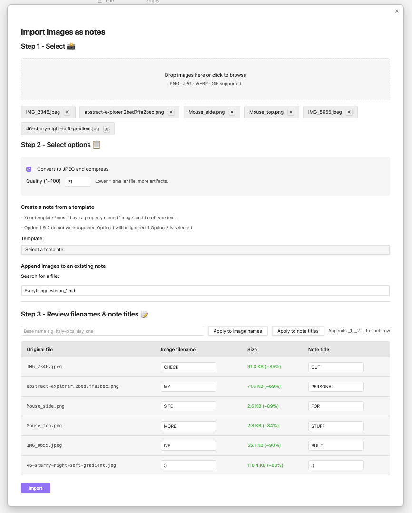
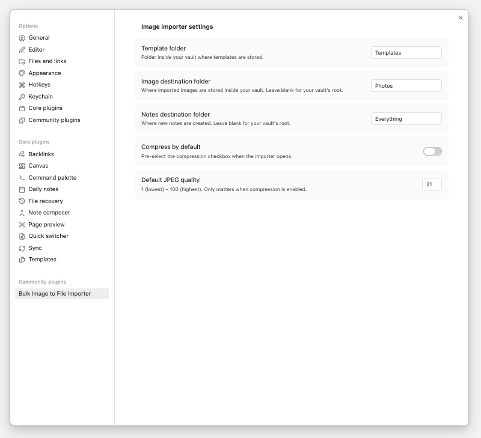

<h1 align="center">Bulk mage to File Importer</h1>

 

## What?

Allows you to bulk import images:
1. As their own file ***without*** a template
2. As their own file ***with*** a template
3. Append images to an existing file

If an image with the same name already exists, it will not be uploaded to your vault again. It will just be referenced as expected.

## Why?

Since I created this plugin to serve two specific purposes of my own, I feel that if I share those examples, it will help illustrate the use of this tool.

### Example 1 - Trip write ups
> When I go on trips, I like to write notes on them. I then like to add highlight photos of those trips to that note. Linking lots of pictures is quite laborious so f*ck that. This tool will add all the photos from my library to obsidian and my preferred note, all in one go.  

### Example 2 - Cataloging Items
>I decided that I wanted to catalogue all my clothes so that I could create a digital wardrobe and create outfits using Obsidian - see my blog [here](https://johnmcanearney.com/) on it.

>Once again, uploading all these pictures, creating a note for them and adding all the metadata/frontmatter for them was *extremely* laborious - and I don't even own that many clothes.

# Donations
If you're thinking of donating, please just donate to [Obsidian](https://obsidian.md/pricing). I think this is a great tool and we should support its development. 

# Usage

## Main Application
###  Step 1 - Select Images
Simply drag multiple files over the grey area or click on the grey area to open the file selector and select multiple files.

You will then see all of your images. You can press the [X] button to remove them from the import

### Step 2 - Select Options
#### Compression
Tick the box to convert the image to JPEG. This just saves space in your vault. Play about with the amount of compression before the image is unusable. 

Once you change the compression value, you will see in the table at the bottom what the new file size will be.

#### Create note from template
Selecting a template will create the image's .md file with that template. This is useful when you are importing lots of clothes and you want them to have the same properties(frontmatter), for example.

#### Append Images
This option ***replaces*** the template option i.e., if you select a template and a note to add it to, the selected note's properties(frontmatter) will remain as is.

### Step 3 - Review filenames
Here you can quickly change the names of all the files. 

You can also use the two button on the first row to apply a common name to all of them. This will append '_1', '_2' and so on... to all the images. 

E.g., italy_trip_day_2 --> italy_trip_day_2_1, italy_trip_day_2_2, italy_trip_day_2_3, italy_trip_day_2_4...

## Settings
